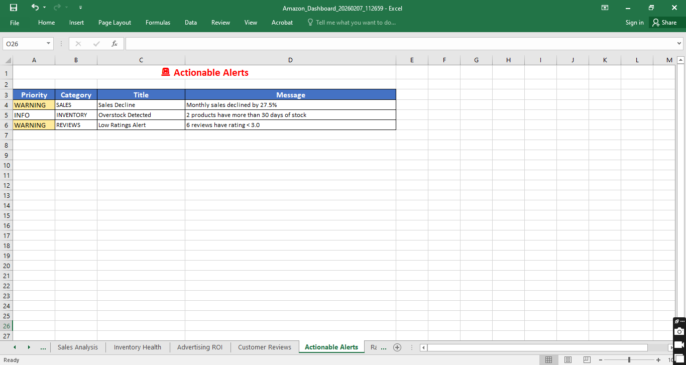
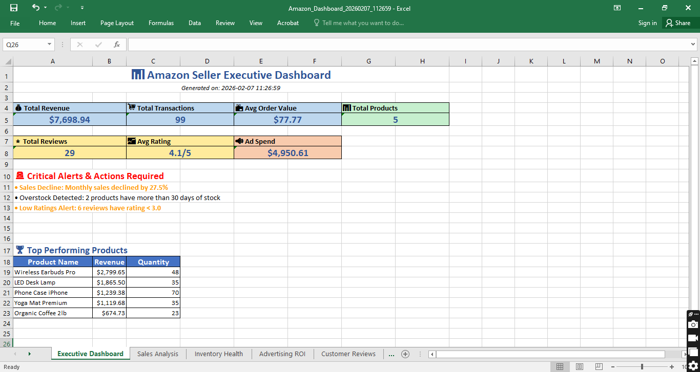
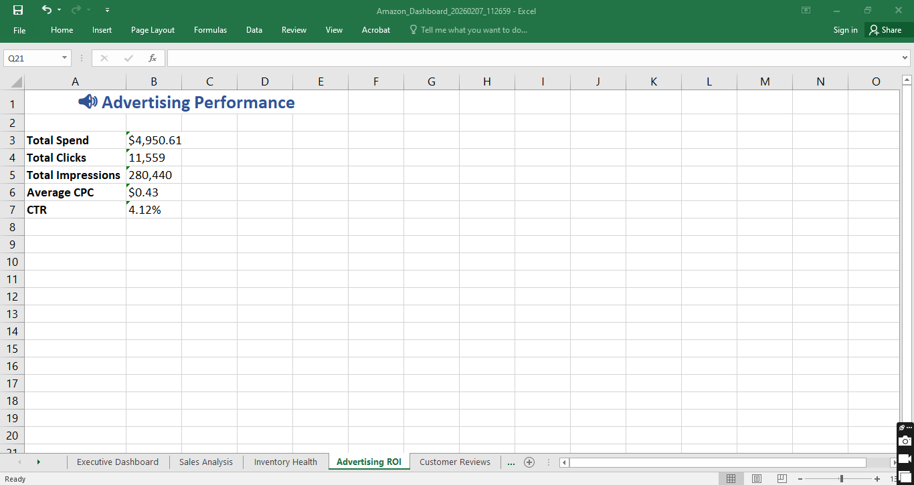
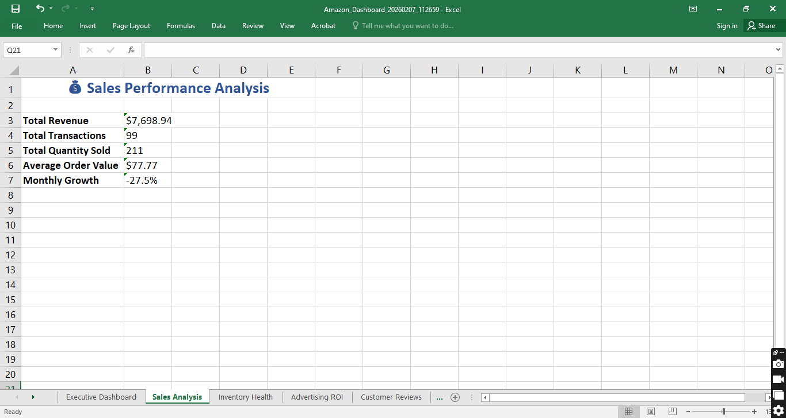
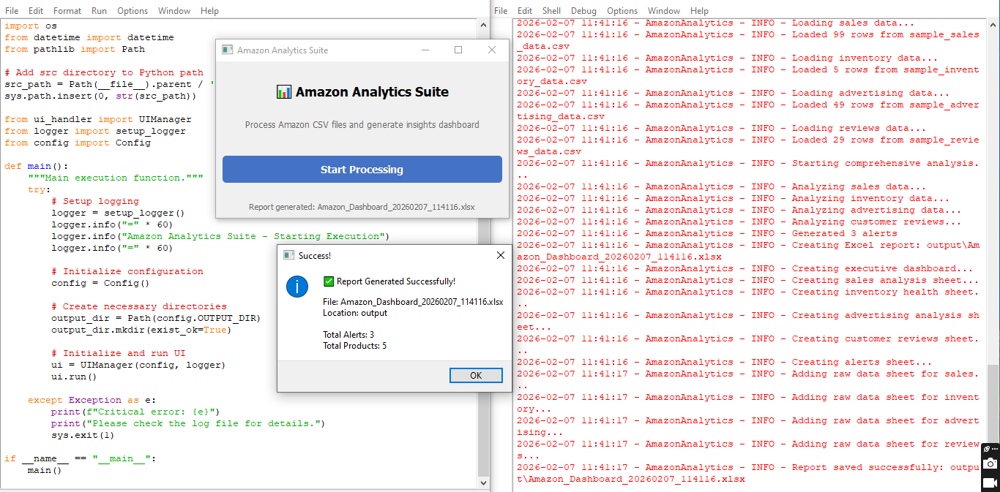

# Amazon Analytics Suite

[](https://www.python.org/)
[](./LICENSE)
[](https://github.com/Abdullah-Ahmadi/amazon-analytics-suite/commits/main)
[](https://github.com/Abdullah-Ahmadi/amazon-analytics-suite/stargazers)

> **Unleash actionable insights from your Amazon business with a powerful modular Python suite. Transform dull CSVs into professional Excel dashboards - faster, smarter, effortlessly.**

## 🛠️ Project Overview

**Amazon Analytics Suite** is your go-to solution for converting Amazon CSV reports into visually compelling Excel analytics dashboards. Whether you're an FBA seller, brand manager, or consultant, our tool brings clarity and actionable intelligence right to your fingertips.

- ✅ **Modular design:** Easy to expand and customize.
- ✅ **Automated workflows:** From data loading to dashboard generation with minimal manual effort.
- ✅ **Professional output:** Generate dynamic Excel dashboards and alerts that stand out.
- ✅ **Sample data included:** Try it out instantly, even if you don’t have your own Amazon CSVs yet.

## 🚀 Why Use Amazon Analytics Suite?

- **Save Time:** Turn hours of manual Excel work into minutes with automated data processing.
- **Unlock Growth:** Spot hidden trends and optimize performance with advanced analytics.
- **Impress Clients & Teams:** Share dashboards that are beautiful, insightful, and ready for presentation.
- **Open-Source Power:** No expensive subscription—customize and adapt freely!

## 📸 Screenshots

Below are some snapshots of what your dashboards and analytics look like:

### Actionable Alerts & Overview



### Performance Insights



### Terminal Run Example


## 📂 Project Structure

```text
amazon-analytics-suite/
├── LICENSE
├── README.md
├── main.py
├── requirements.txt
├── sample_data/
│   ├── sample_advertising_data.csv
│   ├── sample_inventory_data.csv
│   ├── sample_reviews_data.csv
│   ├── sample_sales_data.csv
│   └── README.md
├── screenshots/
│   ├── 01-actionable_alerts.PNG
│   ├── 02-advertising_performance.PNG
│   ├── 03-dashboard_overview.PNG
│   ├── 04-sales_analysis.PNG
│   └── 05-terminal_run.PNG
└── src/
    ├── __init__.py
    ├── analyzer.py
    ├── config.py
    ├── data_loader.py
    ├── excel_writer.py
    ├── generate_sample_data.py
    ├── logger.py
    └── ui_handler.py
```

## ⚡ Quick Start

1. **Clone the repo:**
    ```bash
    git clone https://github.com/Abdullah-Ahmadi/amazon-analytics-suite.git
    cd amazon-analytics-suite
    ```

2. **Install dependencies:**
    ```bash
    pip install -r requirements.txt
    ```

3. **Run the tool:**
    ```bash
    python main.py
    ```
    - Use the sample data in `sample_data/` or supply your own Amazon CSV reports.
    - Dashboards will be generated as Excel files ready to share or further analyze.

## 🤝 Contributing

Love analytics and Amazon data? Contributions are welcome!
- Bug reports, feature requests, and pull requests appreciated.
- Before starting, check the [issues](https://github.com/Abdullah-Ahmadi/amazon-analytics-suite/issues) or open up a discussion.

## 👨‍💻 Author
Abdulla Ahmadi
Software Engineer & Automation Developer

## 📝 License

This project is licensed under the MIT License. See [LICENSE](./LICENSE) for details.

---

**Amazon Analytics Suite** — Because your business deserves smarter data and dashboards.
